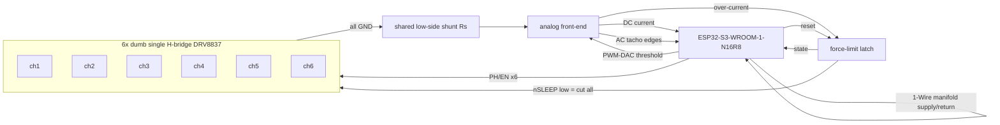

# HeatValve-6 — Rev 2 board design (shared-shunt, dumb-driver)

Status: **design draft for a PCB respin.** Component values marked _(validate)_ are
reasoned starting points to confirm on a prototype channel, not final.

## 1. Goals

- **Safe, deterministic calibration** without the DRV8215's fragilities.
- **Fewest components / simplest layout** that is still **resilient** (per-zone failure
  granularity, no single-driver SPOF).
- Software-based hydraulic balancing (room-temp feedback, **no return probes** — see
  [adaptive_balancing.md](adaptive_balancing.md)), so per-loop return sensing is dropped.
- All parts orderable at LCSC/JLCPCB.

## 2. Architecture in one paragraph

Only one valve moves at a time, so **all sensing collapses onto a single shared low-side
shunt** (the VdMot insight). Six **dumb single H-bridges** (no I²C, no per-driver current
sense) are driven directly from GPIO and share one ground-return shunt. That one shunt
yields three things by splitting the signal: **DC current** (endstop/stall), **AC tacho**
(commutation ripple → edges → position), and a **hardware force-limit** (window comparator
with a firmware-set threshold → latch → global `nSLEEP` cutoff). This removes the six-way
IPROPI wire-OR, the I²C addressing, and the per-driver `RIPROPI` networks of the old board,
while *adding* a tacho and a force-limit it never had.



(A standalone, renderable version of this is in
[hardware_rev2_block.dot](hardware_rev2_block.dot) — `dot -Tsvg hardware_rev2_block.dot`.)

## 3. Power

| Rail | Source | Notes |
|------|--------|-------|
| `VM` (motor) | external supply (e.g. 12 V) | TVS (SMAJ-series) + bulk electrolytic + 100 nF per driver |
| `+3V3` | AP2112K-3.3 LDO (or small buck) | **≥ 500 mA** for WiFi TX peaks; bulk + local decoupling |
| `VBIAS` (≈½·3V3) | coarse divider from `+3V3` | AC-tacho bias only (centres the comparator); **not** a precision current ref |

## 4. Motor drivers — 6× dumb single H-bridge

- **DRV8837** (single H-bridge, `IN1`/`IN2` or `PH`/`EN`, `nSLEEP`, ~1.8 A, no sense, no
  I²C). Six identical blocks → copy-paste layout, **1-zone failure granularity**.
- Per driver: 2 control GPIO + `nSLEEP` + 100 nF decoupling + (optional) small output cap.
  **No `RIPROPI`, no current-set resistor, no I²C pull-ups.**
- **All six `nSLEEP` tie to one net = the force-limit "drive permit."** When the latch
  trips, `nSLEEP` → low → **all bridges Hi-Z instantly**, no per-driver AND gates needed.
- **Drive fixed duty** (`EN` high, no PWM/brake) during a move so the active motor's current
  flows continuously through the shunt → clean tacho + continuous current. Soft-approach near
  an endstop uses position (tacho), not duty chopping, to keep the ripple clean.

```
        VM
        │
   ┌────┴────┐  DRV8837 (one of six)
   │  H-brdg │  IN1 ◄─ GPIO_PHn
   │         │  IN2 ◄─ GPIO_ENn   (fixed-duty during move)
   │         │  nSLEEP ◄─ DRIVE_PERMIT (shared, from latch)
   └──┬───┬──┘
   OUT1   OUT2 ──► motor n
        │
       (chip GND)
        └──────────────► shared shunt node  (all six chip grounds join here)
```

## 5. Shared sense front-end (the heart of the board)

One shunt `Rs` in the **common return of all six driver grounds**. Because only one motor is
energized, `Rs` carries that motor's current (+ a small, calibratable quiescent offset from
the idle chips' awake current). **The current is unipolar**: a full H-bridge always sources
from `VM` and returns through GND no matter which way the motor spins, so the chip-GND shunt
only ever sees positive magnitude — *direction is known from the commanded `PH`*, not the
sign. (This is the key difference from VdMot, whose shunt sat in the motor common and so
swung bipolar and needed a `VREF/2` mid-rail.) That makes the front-end single-ended and the
force-limit a single comparator, not a window.

```
 driver GNDs ─┬─ Rs ─┬─ system GND      V_sense = I·Rs  (>= 0, unipolar)
              │      │
              │      ├─► [non-inv gain] ───────────────► ADC_CURRENT          (A) DC current
              │      │
              │      ├─► [HPF, bias=VBIAS] ─► [gain] ─► [comp + hyst] ─► PCNT  (B) tacho edges
              │      │
              │      └─► [comparator, thr = PWM-DAC] ──► LATCH                 (C) force-limit
```

`VBIAS` (≈ ½·3V3) is a **coarse divider**, used only to centre the AC-coupled tacho so the
comparator sees both edges — it is *not* a precision current reference (there isn't one).

### (A) DC current — endstop / stall / pin-engagement

- `Rs` ≈ **2.2 Ω _(validate)_** — at 50 mA → 110 mV; at a 100 mA stall ceiling → 220 mV;
  power < 25 mW. Drop is negligible vs `VM`.
- **Single-ended non-inverting amp** on `V_sense` (unipolar, sits at 0 V up), gain ≈
  **×8–10 _(validate)_** → ~1 V full-scale into the ADC. No precision reference needed.
- A constant **idle-chip offset** (all six share `nSLEEP`, so all are awake ~1–2 mA each)
  rides on `V_sense`; it's DC, so the firmware's per-pass `cal_baseline` subtracts it (same
  mechanism as today). If the offset is too large, lower `Rs` or gate `nSLEEP` per channel.
- Firmware uses it as today: endstop threshold `mean_dir × factor`, hard cap, undercurrent
  disconnect, pin-engagement step — direction comes from the commanded `PH`, not the sign.

### (B) AC tacho — commutation ripple → position

- AC-couple `V_sense` (high-pass corner ≈ **30 Hz _(validate)_**, below commutation rate but
  above the slow current ramp), gain ≈ **×50–100 _(validate)_** to lift the small ripple.
- Into a comparator with **~10–20 mV hysteresis _(validate)_** → clean digital edges → MCU
  **PCNT** peripheral (hardware edge count). Re-zeroed at each endstop to kill drift.
- This is VdMot's "back-EMF" revolution count, taken from the shared current node.

### (C) Force-limit — configurable, hardware-fast

- **Single comparator** (current is unipolar): `V_sense`-amp vs threshold, set by a
  **PWM-DAC**: one MCU `LEDC` PWM → RC low-pass → comparator reference. (ESP32-S3 has **no
  DAC**, so PWM-DAC; an MCP4725/digipot is the cleaner one-chip alternative.)
- **Per-motor ceiling**: reprogram the PWM-DAC to `mean_i × factor` from telemetry before
  starting motor *i* — one comparator gives a per-motor configurable stall limit.
- Comparator → **latch** (D-FF / SR) → drives `DRIVE_PERMIT` (= all `nSLEEP`). Trip cuts the
  active motor in **µs**, in hardware, independent of the 10 ms firmware tick.
- **Latch controls to MCU**: `RESET` (GPIO out — firmware decides re-arm policy: on back-off,
  after a dwell, or next command) and `STATE` (GPIO in — logged as a fault, feeds relearn).

## 6. Optional BEMF stop-sense (DNP, populate-if-needed)

For the spring-assisted **open** endstop, a magnitude-independent "stopped?" signal is the
ideal backstop. Tap the six motor `OUT1/OUT2` pairs through a `CD74HC4051` (8:1) → divider →
ADC, sampled in a brief coast window. **Lay out, leave unpopulated.** Validate current-ripple
+ current-stall first; populate only if the open stroke proves marginal (see §11).

## 7. MCU & pin budget (ESP32-S3-WROOM-1-N16R8)

Reserve/avoid: flash/PSRAM pins (octal PSRAM on **R8** uses GPIO35–37; flash GPIO26–32),
strapping (GPIO0, 3, 45, 46), USB (19/20 if used).

| Function | Count | Notes |
|----------|-------|-------|
| Driver `PH` (direction) | 6 | GPIO out |
| Driver `EN` (fixed-duty/PWM) | 6 | GPIO/`LEDC` out |
| Tacho edges | 1 | → `PCNT` |
| Current sense | 1 | ADC1 (unipolar; baseline subtracted in firmware) |
| Force-limit threshold | 1 | `LEDC` PWM-DAC |
| Latch reset / state | 2 | GPIO out + in |
| 1-Wire (manifold supply+return) | 1 | DS18B20 ×2 on one bus |
| BLE / WiFi | 0 | on-module |
| **Optional** BEMF mux select + ADC | 3+1 | DNP |
| **Total (core)** | **~20** | comfortable on WROOM-1 |

> `nSLEEP` is **not** an MCU pin — it's the latch's `DRIVE_PERMIT` net. `EN` can be plain
> GPIO (fixed-duty) since force-limit is hardware; use `LEDC` only if you want PWM soft-start.

## 8. Sensors

- **Room temperature** = the balancing feedback: BLE (Shelly BLU H&T) per zone, as today.
- **Manifold supply + return** DS18B20 pair on one 1-Wire bus — diagnostics only.
- **Per-loop return probes: removed.** Not an input to the room-temp balancer.

## 9. BOM (verified against LCSC / JLCPCB, June 2026)

JLC status: **Basic** = preloaded, no per-part feeder fee; **Extended** = orderable, small
setup fee. Stock/status changes — reconfirm at order time on `jlcpcb.com/parts`. For jellybean
analog (LM324/LM339) pick whichever manufacturer variant JLC currently flags Basic/Preferred.

| Ref | Part | LCSC / JLC | JLC status | Qty | Notes |
|-----|------|-----------|-----------|-----|-------|
| U1 | ESP32-S3-WROOM-1-N16R8 | **C2913202** | Extended (stocked) | 1 | 16 MB flash / 8 MB PSRAM; `-1U` = C3013946 |
| U2–U7 | DRV8837**DSGR** | **C39159** | Extended | 6 | dumb H-bridge, `IN1/IN2`, `nSLEEP`, `VM`+`VCC`; WSON-8. **Netlist targets this (non-C) pinout** — the `C` variant (C191000) drops `VCC` and re-maps pins, so don't swap without re-wiring |
| U8 | LM324 (quad op-amp) | **C351427** | Basic-class | 1 | current diff-amp + tacho gain + ref buffer (3 of 4) |
| U9 | LM339 (quad comparator) | **C504552** | Basic-class | 1 | tacho edge + force-limit window (3 of 4) |
| U10 | 74HC74D (dual D-FF) | **C27597** | Extended | 1 | force-limit latch (1 of 2) |
| U11 | AP2112K-3.3TRG1 | **C51118** | **Basic** | 1 | 3V3 LDO, 600 mA, SOT-25 |
| U12 | CD74HC4051PWR | **C352826** | Extended | 1 | **DNP** — optional BEMF mux (§6) |
| Rs | 2.2 Ω 0.25 W _(validate)_ | generic | Basic | 1 | shared shunt (1206 for power/heat) |
| D1 | SMAJ-series TVS (per `VM`) | generic | Basic | 1 | e.g. SMAJ15A for 12 V `VM` |
| C_bulk | 100–470 µF electrolytic | generic | Basic | 1–2 | `VM` bulk (motor inrush) |
| — | 100 nF ×~12, RC/divider/HPF passives | generic | Basic | — | decoupling, PWM-DAC RC, ref divider, AC-couple |

**Active-IC count: 10** (1 module + 6 drivers + 2 analog + 1 latch), of which only the module,
drivers, 74HC74 and (DNP) mux are Extended; everything else is JLC Basic. The two jellybean
analog ICs (LM324 + LM339) replace what would otherwise be six per-driver `RIPROPI`/sense
networks — they're the VdMot-precedented choice (VdMot used the LM224 = same LM324 family).

vs the old board: **− 6× `RIPROPI` networks, − I²C pull-ups/addressing, − per-driver config
passives; + 1 shunt, + LM324 + LM339, + 1 latch.** Net fewer parts, plus tacho + force-limit.

> Driver note: `DRV8837CDSGR` (C191000) is the cheapest well-stocked variant but is Extended.
> If you want to minimise Extended parts, `DRV8837DSGR` (**C39159**) is the other TI option;
> both are Extended (small H-bridges generally are). The LM324/LM339/AP2112K being Basic keeps
> the feeder-fee count low.

## 10. Net / connection list (capture this in EasyEDA/KiCad)

Power/ground nets omitted for brevity except where signal-relevant.

```
NET VM            : VMext, U2..U7.VM(1), C_bulk+, D1.cath              ; Rs is NOT here (low-side)
NET GND           : U1.GND, U11.GND(2), Rs.2, C_bulk-, U8.GND(11), U9.GND(12), U10.GND(7)
NET SHUNT         : Rs.1, U2..U7.GND(4), U8 current-amp in, U8 tacho AC-couple in, U9 force-limit in
NET VBIAS         : 3V3 divider mid, U8 tacho-amp bias, U9 tacho-comp ref     ; coarse, AC only
NET DRIVE_PERMIT  : U10.1Q(5), U2..U7.nSLEEP(7)                        ; latch trip -> all asleep
NET I_SENSE       : U8 current-amp out -> U1 ADC1 (GPIO4)
NET TACHO_EDGE    : U9 tacho-comp out -> U1 PCNT (GPIO15)              ; LM339 open-collector + pull-up
NET FLIM_THR      : U1 LEDC (GPIO16) -> RC -> U9 force-limit comp ref
NET FLIM_TRIP     : U9 force-limit comp out -> U10.1CLK(3)             ; open-collector + pull-up
NET LATCH_RESET   : U1 (GPIO17) -> U10.1nPRE(4)                        ; pulse low = re-arm (Q->1)
NET LATCH_STATE   : U10.1nQ(6) -> U1 (GPIO18)                          ; high = tripped (logged)
NET PH1..PH6      : U1 GPIO9..14 -> U2..U7.IN1(6)
NET EN1..EN6      : U1 GPIO47,48,38,39,40,41 -> U2..U7.IN2(5)
NET MOT1..MOT6    : U2..U7.OUT1(2)/OUT2(3) -> manifold actuator n
NET OW_MANIFOLD   : U1 (GPIO42) -> DS18B20 supply + return
; --- optional / DNP ---
NET BEMF_x        : U2..U7 OUT pairs -> U12 mux -> U1 ADC1 (GPIO6); mux sel -> U1 GPIO1,2,21
```
The machine-importable KiCad netlist of this is
[hardware_rev2.net](hardware_rev2.net) (`File > Import > Netlist` in EasyEDA / KiCad).
Op-amp/comparator support passives (gain resistors, hysteresis, pull-ups, PWM-DAC RC) are
included with _(validate)_ values — confirm on the prototype channel (§12).

## 11. Firmware mapping

- **PCNT** counts `TACHO_EDGE`; position = count from the last endstop re-zero. Flow band
  (pin-engagement → close) is the loaded, strong-ripple region — count there; coarse-time the
  open dead band.
- **ADC** reads `I_SENSE − VREF_HALF` (signed current) for endstop / stall / pin step.
- **LEDC PWM-DAC** sets `FLIM_THR = mean_i × factor` per motor before each move.
- **GPIO** drives `PH/EN` fixed-duty; reads `LATCH_STATE` (force-limit fired → fault/relearn),
  pulses `LATCH_RESET` per the chosen re-arm policy.
- Calibration logic (close→open→close, pin-engagement re-baseline, runtime cap) carries over;
  the tacho turns time-estimates into real position and makes already-at-stop detectable.

## 12. Bring-up / validation (prototype one channel first)

1. **Shunt + DC current**: drive a motor, confirm signed current matches a meter across the
   13–50 mA range; null the idle-chip quiescent offset via `VREF/2`.
2. **Tacho integrity** _(gate to populating all six)_: drive fixed-duty, verify the AC chain
   produces clean edges; count a full **flow-band** stroke, re-zero at close, check
   **repeatability within a few %**. Tune HPF corner / gain / hysteresis.
3. **Force-limit**: set `FLIM_THR` low, stall the motor, confirm `nSLEEP` cutoff in µs and the
   latch state/reset path; then set the real per-motor ceiling.
4. **Open endstop**: if the open stroke can't be caught reliably by current + tacho, **populate
   the BEMF path** and validate stop-by-BEMF.
5. Only then lay out and stuff all six identical blocks.

## 13. Resilience

- 6 independent bridges → **one driver dies = one zone**, rest keep running (same as today).
- Shared points: the shunt/front-end and the latch. Both are tiny, low-stress silicon; a
  front-end failure degrades to **open-loop time-driven** moves (limp mode), not loss of heat.
- NO valves fail **open** (warm) on power/driver loss — the safe direction for heating.
- Want lower part count over granularity? Swap 6 singles → **3 dual H-bridges** (DRV8833),
  2-zone granularity, same shunt/front-end.

## 14. Open items to finalize on the prototype

- `Rs` value + diff-amp gain for your exact `VM` and motor current band.
- Commutation-ripple frequency (sets the HPF corner and comparator hysteresis) — **measure**.
- Per-motor `factor` for the force-limit ceiling vs learned mean.
- Whether the BEMF path is needed (open-endstop margin).
